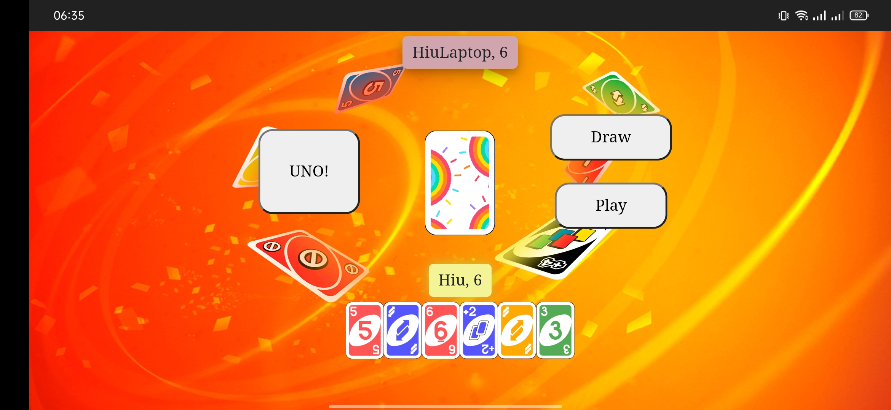

# ULO
A fake version of UNO game

## Introduction
You get too tired when always bringing the UNO physical set? Or is it because of the limitations of the free version of UNO in other UNO games? Don't worry... I mean, don't worry alone, me too :'( 

This repository is created for two main reasons: 
- <b>First, recently, I learned about <i>Golang</i>, so I want to do some projects to practice </b>
- Second, as mentioned earlier, I want to create my UNO game to play exclusively with my friends. However, the current version is not optimal in terms of both UI and UX, there are also some bugs XD

<b>Currently, the UI of this game is created by HTML, CSS, and Javascript</b>

If you have noticed that I created some games in <b>Unity</b> for my Game Development Class (You can check them in my profile). So I believe that if I had more free time (and yeh, more interest), I could convert this game into a better version in terms of both UI and UX. 

## Some notes about the game (features, code,...)
- All the logic in this game is based-on my house-rules
- I haven't learn to deploy something on the internet yet, so I just use the local network (Wifi) to connect the players to a central server
- The UI of this game is mainly designed for mobile devices

## Here, some pictures of my game

